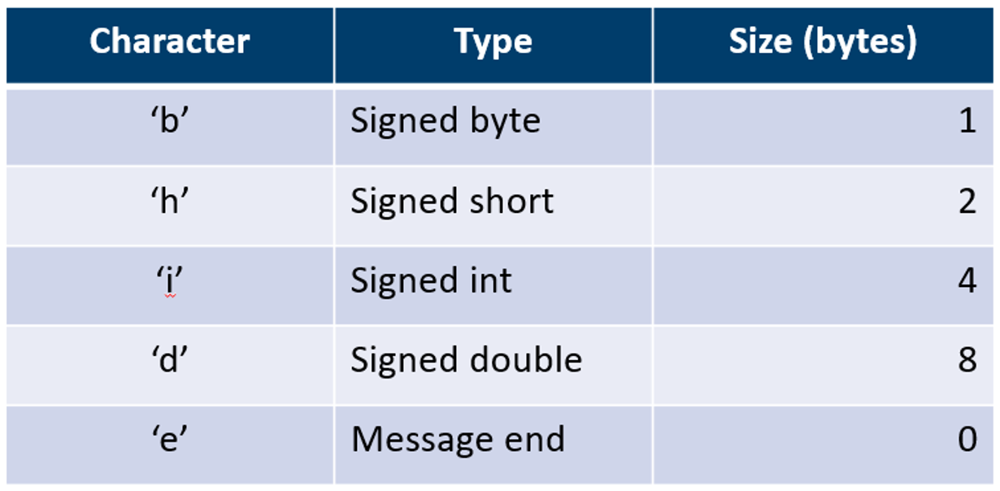

{::options parse_block_html="true" /}

### Lab #1: Intro C Programming (100 pts)

<div class="alert alert-info" role="alert">
#### **There are two goals for this assignment:**


  - To get a taste for writing code in the C programming language. 
  - To build a mental understanding for pointers and type casting. 
  
</div>

<div class="alert alert-danger" role="alert">
#### **What should be turned in?**


  1. Your **commented** summate.c file. 
  2. We will have an in class quiz in which you will be required to modify and run your program and report the answers. 

</div>

#### Due Date: __Wednesday, January 19, 2022__


#### Introduction

You are welcome to use any C compiler that you have access too (e.g, if you are running Linux or another Unix-like environment
on your own computer). The instructions below assume that you have logged into the Rice student cluster, CLEAR.
You can connect to CLEAR using ssh: `ssh netid@ssh.clear.rice.edu` will work if you are on campus or VPN. Otherwise
you will need to first `ssh netid@ssh-students.rice.edu`, and then type in `ssh.clear.rice.edu` at the `Enter remote host:` prompt.
If you are on campus or connected via VPN, you can mount your home directory using the Samba protocol. (See 
(https://kb.rice.edu/93597)[https://kb.rice.edu/93597] for
assistance.) This will allow you to use a GUI code editor such as Visual Stuio Code.
The examples done in class on Tuesday will be available in the `/clear/courses/elec327/2021/` directory.

In C, variables are associated with "types". The core types include ASCII characters, integers, 
and floating point numbers. In this lab, we will explore the fact that C allows us to directly
reference memory, and allows portions of memory to be interpreted as different types. Because the
interfaces to peripherals in embedded systems are through the memory bus, understanding how
to access memory is critical to programming embedded systems. In addition, passing by reference 
(using pointers) is the only method in C for giving a function a variable that it should modify.

#### The Task

Many embedded systems will communicate data to a microprocessor. Sometimes, the structure of the
data can be known precisely ahead of time, but sometimes the message payload may need to hold
different items, including variables of different sizes. In this lab, your program needs to
interpret a message that has been received from an embedded system. The messages contain a series
of numbers, and the task for your program is to sum these. The challenge is that the numbers are
all different types. Each message includes a header, which is a series of characters which describe
the types of the numbers in the message. This is followed by the numbers themselves. The message
is padded with zeros to a final size of 100 bytes. Your program should print out the sum of the numbers
in the message file provided as a command line argument.

The characters in the header are described in the following table (you may recognize these if you've used
the [python struct library](https://docs.python.org/3/library/struct.html)) :


<!--- 
| Character | Type | Size (bytes) |
| :---: | :---: | ---: |
| 'b' | signed byte | 1 |
| 'h' | signed short | 2 |
| 'i' | signed int | 4 |
| 'd' | signed double | 8 |
| 'e' | special character denoting message end | 0 |
--->

The `'e'` character denotes the end of the header. The numbers directly follow it, packed tightly.

The code that I am using to create the files you will work with is actually python. It's [here]
(make_example.py):
```python
import struct

def write_list_to_file(data_list, ofname):
  format_only = [ x[0] for x in data_list]
  data_only = [x[1] for x in data_list]
  print('=' + ''.join(format_only))
  print(data_only)
  of = open(ofname, 'wb')
  of.write(struct.pack('='+'c'*(len(format_only)), *[bytes(c, "utf-8") for c in format_only]))
  of.write(struct.pack('=c', b'e'))
  of.write(struct.pack('='+''.join(format_only), *data_only))
  padding = 100 - of.tell()
  of.write(struct.pack('={}b'.format(padding), *bytearray(padding)))
  of.close()

# 'b' = signed char, 'i' = 4 byte int, 'd' = 8 byte double

example1 = [('b',-100), ('i',-100), ('d', -100.0), ('i', -100), ('d', -100.0), ('b', -100)]
example2 = [('i',10000), ('b',-100), ('b', -100), ('b', -100), ('b', -100), ('b', -100)]
example3 = [('d',1e7), ('i',10000), ('b',-100), ('b', -100), ('b', -100), ('b', -100), ('b', -100)]

write_list_to_file(example1, 'example1.bin')
write_list_to_file(example2, 'example2.bin')
write_list_to_file(example3, 'example3.bin')


```

For the [example1.bin](example1.bin) file, the proper return value is `-600.0` (the number of
trailing zeros is not critical). More examples: [example2.bin](example2.bin) and 
[example3.bin](example3.bin). A template C file is given in
[summate_template.c](summate_template.c). Your task is to fill in the `compute_sum()` function.


**Upload your code to Canvas and be ready for live coding (we'll introduce a wrinkle!)
in class on Tuesday.**

